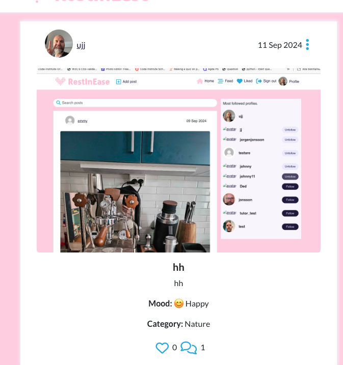

Welcome to Rest in Ease, your safe space on social media. Here, you can share your favorite safe spots and express how you’re feeling at any moment. Sometimes, simply sharing how you feel can make a big difference. At Rest in Ease, no one will judge you—this is a community built on understanding and support. Whether you’re looking for a place to vent, seek comfort, or connect with others who understand, Rest in Ease is here for you. Join us and find solace in knowing that you’re not alone.

## Table of Contents

- [Introduction](#introduction)
- [Agile Methodology](#agile-methodology)
- [API](#api)
- [User Experience (UX)](#user-experience-ux)
  - [The Strategy](#the-strategy)
  - [The Scope](#the-scope)
  - [The Structure](#the-structure)
  - [The Skeleton](#the-skeleton)
  - [The Surface](#the-surface)
- [User Stories](#user-stories)
- [Am I Responsive](#am-i-responsive)
- [Project Overview](#project-overview)
  - [Learning Objectives](#learning-objectives)
  - [Assignment Requirements](#assignment-requirements)
  - [Self-Assessment](#self-assessment)
  - [Reusable Components](#reusable-components)
- [Features](#features)
  - [The Features](#gifs)
  - [Future Features](#future-features)
- [Technologies Used](#technologies-used)
  - [Tools](#tools)
  - [Languages](#languages)
  - [Frameworks & Libraries](#frameworks-and-libraries)
  - [Design](#design)
- [Testing](#testing)
  - [Bugs](#bugs)
- [Setup and deployment](#setup-and-deployment)
  - [Create Repository](#create-repository)
  - [Intalize in VS Code](#intalize-in-vs-code)
  - [Create React App](#create-react-app)
  - [Deployment](#deployment)
- [Documentation](#documentation)
  - [Project documentation](#project-documentation)
- [Credits](#credits)
  - [Content](#content)
  - [Media](#media)
  - [Thank You](#thank-you)

## <a id="introduction">Introduction</a>

## <a id="agile-methodology">Agile Methodology</a>

This is my Kanban board for this project.
This project is divided into 7 milestones with specific due dates and includes 32 user stories.

The Kanban board is an essential tool for tracking progress and ensuring efficient project management. It is organized into several columns: To Do, In Progress, Done, Bugs, Future Features, and Won’t Have.

- To Do: Tasks that are planned and ready to be worked on.
- In Progress: Tasks that are currently being worked on.
- Done: Completed tasks.
- Bugs: Identified issues that need to be fixed.
- Future Features: Ideas and features planned for future implementation.
- Won’t Have: Tasks and features that have been decided against including.

Using the Kanban board has helped me maintain a clear overview of the project, ensuring that tasks are properly tracked, prioritized, and completed efficiently. While the Kanban board focuses on higher-level planning and project progress, I have also developed detailed user stories for each specific feature of the application, documenting how different parts of the project align with user needs and goals.

This approach allows for both a broader view of the project timeline and detailed insight into how individual functionalities are built and integrated.

I find this combination of Kanban and detailed user stories essential for staying organized and focused, and I look forward to further developing these skills in future projects!
You can visit the Knaban board here:
[Kanban](https://github.com/users/JorgenDIF/projects/7)

## <a id="api">API</a>

The Rest In Ease social media app utilizes an API built with Django Rest Framework. For more details, please visit the
[repository](https://github.com/JorgenDIF/PP5-RestInEase-API)

## <a id="user-experience-ux">User Experience (UX)</a>

### <a id="the-strategy">The Strategy</a>

Read The Strategy

The goal of the Rest In Ease social media app is to create a platform where users can share their safe spots and express their feelings. Users can post and comment to convey their emotions, fostering meaningful connections through shared emotional experiences. The focus is on providing a space where emotional expression is encouraged, helping users connect with others and share their current state of mind.

### <a id="the-scope">The Scope</a>

Read The Scope

The scope of the Rest In Ease social media app includes:

1. User Profiles:

- Allow users to create and customize their profiles.
- Enable users to follow and interact with other users.

2. Posts:

- Enable users to add photos and express their feelings.
- Allow users to choose a category for their photos and share posts with images and text.
- Implement features for liking, commenting, and sharing posts.

3. Comments:

- Allow users to comment on posts.
- Enable users to express their feelings in comments.

4. Likes:

- Implement a feature for users to like posts.
- Display the number of likes on each post.
- Allow users to view who liked their posts.

5. User Interaction:

- Implement features for users to follow other users.

6. Search and Explore:

- Implement search functionality to find posts by keywords and users by name.
- Provide an explore feature to discover popular and recent posts.

 

### <a id="the-structure">The Structure</a>

Read The Structure

The structure of the Rest In Ease social media app will include the following components:

1. Front-End:

- User Interface: Designed with a focus on user experience and ease of use.
- React Components: Modular components for posts, comments, profile pages, and navigation.

2. Back-End:

- Django Rest Framework API: Handles user authentication, data storage, and API requests.
- Database: Stores user data, posts, comments, and interactions.

### <a id="the-skeleton">The Skeleton</a>

Read The Skeleton

The skeleton of the Rest In Ease social media app outlines the basic structure and layout of the application based on the provided ERD (Entity-Relationship Diagram). The diagram shows the relationships between users, profiles, posts, comments, likes, and followers, which guide the overall structure of the app.

1. **Home Page:**

- **Feed of Recent and Popular Posts:**
- Display a list of posts fetched from the API.
- Include post details like title, content, image, mood, and the number of likes.

- **Search Bar:**
- Allow users to search for posts and users by keywords.

2. **Profile Page:**

- User Information:
- Display user details such as username, profile image, name, and bio.

- **User’s Posts and Interactions:**
- List all posts created by the user.

- **Followers and Following:**
- Display the list of users who follow the current user.
- Show the list of users the current user is following.

3. **Post Page:**

- **Detailed View of Individual Posts:**

- Display post details like title, content, image, mood, category, and number of likes.
- Show the owner of the post and the post’s creation and update dates.

- **Comments Section:**

- Allow users to view and add comments to the post.

- Display each comment’s owner, content, and mood.

4. **Create Post Page:**

- Form for Creating New Posts:
- Provide fields for the post title, content, image, mood, image filter, and category.
- Allow users to express their current feelings.

5. Likes and Follower Functionality:

- **Likes:**

- Allow users to like posts.
- Display the number of likes on each post and the users who liked the post.

- **Followers:**
- Allow users to follow and unfollow other users.
- Display the number of followers and following on the user profile page.

### The Wireframes can be found here:

Sign Up

Sign Up Iphone

Profile Page

Profile Iphone

Post Page

Post Iphone

Posts Page

Posts Iphone

### <a id="the-surface">The Surface</a>

The Surface

The visual design of the Rest In Ease application is aimed at creating a calming and inviting environment where users feel comfortable sharing their emotions and safe spots. Below is a breakdown of the key design elements that contribute to the app’s aesthetic and user experience.

**Typography**

The design of the Rest In Ease app uses a clean, modern aesthetic with soft, soothing colors to create a calming user experience. The primary typefaces are Lato for body text, providing clarity and readability, and Roboto for headings, offering a modern and bold contrast.

**Color Scheme**

- Primary colors like white (#ffffff) and light gray (#f8f6fc) create a clean and neutral background.
- 	Accent colors include:
-	Pink (#fecddf) for warmth in the logo and background elements.
- Blue (#3fa5dc) for interactive elements like buttons and links, adding a calming tone.
- Green (#28dba5) for important actions, bringing energy to key interactions.
- Dark navy (#1f173d) for strong contrast in text and buttons, ensuring readability.

These choices combine to create a simple, welcoming, and easy-to-navigate interface.

This palette shows my colors

**Visual Elements**

- Icons: Simple, universally understood icons are utilized throughout the app to represent emotions (e.g., smiling face, heart, and tears), guiding users through their posts and comments.
- Images: Users are encouraged to upload high-quality images of their safe spaces, giving the app a personal and intimate feel.
- Emotional Expressions: Each post and comment features a visual representation of the user’s mood, using emoji icons paired with descriptive text, helping users easily connect through shared emotional experiences.

**Layout**

- Consistency: Uniform layouts across all pages to provide a seamless user experience. The navigation structure remains the same across the app to ensure familiarity.
- Spacing: Ample white space between elements to keep the design clean and easy to read. The balance between elements enhances the visual experience without overwhelming the user.
- Responsive Design: The app is fully responsive, adjusting to different screen sizes on mobile devices, tablets, and desktops, ensuring usability across all platforms.

**User Interface Components**

- Buttons: Rounded buttons with soft shadows are used for interaction, making it clear where users can engage (e.g., “Post”, “Comment”, “Like”). Favicon-sized icons are integrated into these buttons, adding a visually engaging touch that enhances user interaction and navigability. Favicons are also used for menu selections and options like “Like” and “Comment,” providing intuitive visual cues for user actions.
- Forms: User-friendly forms with spacious input fields and clear labels. Input validation ensures users receive real-time feedback on any errors.
- Menus: Dropdown menus for editing or deleting posts,comments and editing profiles, along with a hamburger navigation for mobile users, provide easy access to various features without cluttering the interface. These streamlined options ensure that users can manage their content efficiently while maintaining a clean, organized layout.

These design elements are carefully selected to create a peaceful, intuitive, and emotionally engaging environment for users, aligning with the platform’s goal of fostering safe, meaningful emotional expression.

## <a id="am-i-responsive">Am I Responsive</a>

Showing of the responsiveness of the website on different devices.

Click to show image

## <a id="user-stories">User Stories</a>

User Stories

| Feature                         | User Story                                                                                                                       | Acceptance Criteria                                                                                                                                                  | Components Used                                                |
|----------------------------------|----------------------------------------------------------------------------------------------------------------------------------|---------------------------------------------------------------------------------------------------------------------------------------------------------------------|----------------------------------------------------------------|
| **Navbar View on Every Page**    | As a user, I want to see a navigation bar on every page so that I can easily navigate between different sections of the site.     | 1. The navbar is consistently displayed on every page.   2. The user can click links to navigate to different pages.                                               | `NavBar`, `NavLink`                                             |
| **Sign Up for New Account**      | As a user, I want to create a new account so that I can access all the features available to registered users.                    | 1. A sign-up form is implemented.   2. Users can successfully create an account and log in.                                                                       | `SignUpForm`,`Form`, `Button`                      |
| **Sign In to Access Features**   | As a user, I want to sign in to the app so that I can access functionality for logged-in users.                                   | 1. The sign-in form is implemented.   2. Users can log in with their credentials.                                                                                 | `SignInForm`, `useSetCurrentUser`, `Form`, `Button`             |
| **Search Posts by Keywords**     | As a user, I want to search for posts using keywords so that I can find specific posts based on titles, content, or categories.   | 1. A search bar is implemented.   2. Posts are searchable by title, content, and category.   3. The search results are updated in real-time based on input.     | `PostsPage`,`Form`, `Input`, `SearchBar`           |
| **Create New Posts**             | As a logged-in user, I want to create new posts with images and descriptions so that I can share my content with other users.     | 1. A form for creating new posts is available.   2. Users can add a title, content, image, and select mood and category.                                           | `PostCreateForm`, `Form`, `Button`, `Image`         |
| **Edit My Post Details**         | As a post owner, I want to edit my post's title, description, mood, and category so that I can update my content after creation.  | 1. A dropdown menu (MoreDropdown) is available on the post page.   2. Users can click the dropdown and select "Edit" to modify the post.   3. Changes saved.   | `MoreDropdown`, `PostEditForm`, `axiosReq`                      |
| **Delete My Post**               | As a post owner, I want to delete my post so that I can remove it from the application.                                           | 1. A dropdown menu (MoreDropdown) is available on the post page.   2. Users can click the dropdown and select "Delete" to remove the post.   3. Post deleted.   | `MoreDropdown`,`PostDelete`                        |
| **View Post Details**            | As a user, I want to view the details of individual posts so that I can see the full content and any associated comments.         | 1. Post details are displayed, including title, image, and content.   2. Users can see the mood and category associated with the post.                             | `Post`,`Image`, `Mood`, `Category`                 |
| **Like a Post**                  | As a logged-in user, I want to like a post so that I can show appreciation for its content.                                       | 1. A "like" button is available for each post.   2. The like count updates when the user clicks the button.                                                       | `LikeButton`, `axiosReq`                                        |
| **Add Comments to Posts**        | As a logged-in user, I want to add comments to a post so that I can share my thoughts about the post.                             | 1. Users can add comments to posts using a comment form.   2. Comments are saved and displayed in real-time.   3. Users can add a "feeling" (mood) to comments. | `CommentCreateForm`, `Form`, `Button`               |
| **Edit My Comments**             | As a comment owner, I want to edit my comments so that I can update my content after it has been posted.                         | 1. A dropdown menu (MoreDropdown) is available on the comment.   2. Users can click the dropdown and select "Edit" to modify the comment.   3. Changes saved.   | `MoreDropdown`, `CommentEditForm`,                  |
| **Delete My Comments**           | As a comment owner, I want to delete my comments so that I can remove them from the application.                                  | 1. A dropdown menu (MoreDropdown) is available on the comment.   2. Users can click the dropdown and select "Delete" to remove the comment.   3. Comment deleted. | `MoreDropdown`, `CommentDelete`                     |
| **Edit My Profile**              | As a logged-in user, I want to edit my profile so that I can update my name, bio, and profile picture.                            | 1. A profile edit form is available.   2. Users can update their profile information and image.                                                                   | `ProfileEditForm`,  `Form`, `Button`                 |
| **View User Profiles**           | As a user, I want to view the profile of other users so that I can see their posts and learn more about them.                    | 1. Profile page shows the user’s details, posts, and statistics.   2. User stats include followers, following, and post counts.                                   | `ProfilePage`, `Profile`                          |
| **Infinite Scroll**              | As a user, I want to continuously scroll through the list of posts without needing to load new pages so that browsing is smooth.  | 1. New posts are loaded automatically as the user scrolls.   2. The scroll continues until all posts are loaded.                                                  | `InfiniteScroll`, `Post`                           |
| **Landing Page (PostsPage)**     | As a user, I want to land on a page where I can see the most recent posts and have the ability to search and browse posts.        | 1. The landing page shows all the most recent posts.   2. Users can search for posts using keywords.   3. The page supports infinite scrolling for posts.      | `PostsPage`, `Post`, `SearchBar`, `InfiniteScroll`, 
| **Follow/Unfollow Users**       | As a logged-in user, I want to follow or unfollow other users so that I can see or stop seeing their posts in my feed.                                      | 1. A "Follow" button appears on profiles I don’t follow.   2. A "Unfollow" button appears on profiles I already follow.   3. Followers count updates.   | `Button`, `Profile`, `useSetProfileData` |
| **View Most-Followed Users**    | As a user, I want to see the most-followed users so that I can discover popular profiles to follow.                                                        | 1. A list of the most-followed users is visible.   2. The list is ordered by the number of followers.                                                     | `PopularProfiles`, `Profile`     |
 **Like Posts (Except Own)**     | As a logged-in user, I want to like posts so that I can show appreciation for others’ content, but not be able to like my own posts.                       | 1. A “like” button is visible on posts that aren’t mine.   2. Users can like and unlike posts, but not their own.   3. Like count updates in real-time. | `Post`,`OverlayTrigger`, `Tooltip` 

## <a id="project-overview">Project Overview</a>

### <a id="learning-objectives">Learning Objectives</a>

### <a id="assignment-requirements">Assignment Requirements</a>

### <a id="self-assessment">Self-Assessment</a>

### <a id="reusable-components">Reusable Components</a>

This application features reusable components, which help maintain scalability and efficiency. Below are examples:

Click to show components

#### NavBar Component:

- Purpose: Provides navigation across the application, showing sign-in options, user profile 
  links, and post creation.
- Reusability: The NavBar is used across all app routes to maintain consistent navigation.
- Props: Displays dynamic links based on user authentication status.

#### MoreDropdown Component:

- Purpose: Allows users to edit or delete posts/comments.
- Reusability: Used in post, profile, and comment components to manage user-specific actions.
- Props: Functions like handleEdit, handleDelete.

#### Avatar Component:

- Purpose: Displays user profile images.
- Reusability: Used across the app to consistently display user images in posts, comments, and 
  profiles.
- Props: src, height, text.

#### Profile Component:

- Purpose: Displays user profile details, including follow/unfollow actions.
- Reusability: Used on the profile page and in the PopularProfiles component to maintain 
  consistent display.
- Props: profile, imageSize, mobile.

 

## <a id="features">Features</a>

### <a id="the-features">The Features</a>

Click to show features

#### Home Page
When you enter the site, you’re greeted with a list of posts and clear options to Sign In or Sign Up. The page is designed to make you feel welcome and encourage exploration, providing an easy entry point to engage with the app.

Click to show home image

  

 

####  Sign Up Page

This is where you can create an account for the Rest In Ease app.

Click to show sign up image

 

#### Sign In Page

This is where you log in after creating an account. 

Click to show sign in image

 

#### Home Page Signed In
This is what the Home Page looks like after signing in.

Click to show signed in homepage image

 

#### Feed

This is the user’s feed where you can see posts from users you follow.

Click to show feed image

 

#### Liked
Here, the user can view the posts they have liked.

Click to show liked image

 

#### Profile

This is the user’s profile page.

Click to show profile image

 

#### Dropdown Profile

This displays the dropdown menu for the profile.

Click to show profile dropdown image

 

#### Edit Profile

This is where the user can edit their profile, update their bio, and change their photo.

Click to show edit profile image

 

##### Create Post

This is where the user can create a post. They are required to select a category and mood. 

Click to show create post image

 

#### Single Post

This is where you land when you click on one of your posts.

Click to show create single post image

 

#### Dropdown Post

This is the dropdown menu for a user’s post, where you can edit or delete it.

Click to show post dropdown image

 

#### Edit Post

This is the page where you can edit a post.

Click to show edit post image

 

#### Create Comment

This is the page where you can create a comment. The user is required to select a feeling.

Click to show create comment image

 

#### Dropdown Comment

This is the dropdown menu for a comment created by the user.

Click to show dropdown comment image

 

#### Edit Comment

This is the page where you can edit or delete a comment.

Click to show edit comment image

 

#### Most Followed Profiles

Here you can see the most followed profiles

Click to show Popular profiles image

 

#### Mobile mode

Two GIFs showing the app in iPhone mode, highlighting its main interface and mobile responsiveness.

Click to show iphone gif-1

 

Click to show iphone gif-1

 

### <a id="future-features">Future Features</a>
**Important**
- Initially, I intended to manage the category, mood, and feeling fields dynamically from the backend, which would allow for simpler updates by only modifying the models. However, due to time constraints, I implemented these fields both in the backend models and in the frontend. By hardcoding the options in both the frontend and backend, the fields are currently functional but lack flexibility. Moving forward, I plan to streamline this by updating only the backend models, so that any changes will automatically propagate to the frontend, resulting in a more dynamic and scalable solution.

## <a id="technologies-used">Technologies Used</a>

Click to show technologies

1. Axios (v0.24.0): A promise-based HTTP client that facilitates communication between the frontend and backend. Axios simplifies making HTTP requests to the REST API and manages headers automatically. In addition, it supports interceptors, which help handle token refreshing for user authentication, improving the user experience by allowing users to stay logged in without frequent re-authentication.
2. React Bootstrap (v2.0.0): A frontend framework for React that provides pre-built responsive components. This was chosen to accelerate development by offering an array of customizable components like forms, buttons, and dropdowns, enabling focus on core functionality rather than building components from scratch.
3. JWT-Decode (v3.1.2): Used to decode JSON Web Tokens (JWT) in the authentication process. This helps maintain secure user sessions by verifying the authenticity of tokens and extracting user information from them.
4. React (v17.0.2): The core JavaScript library used for building the user interface. React enables the creation of reusable components and handles dynamic updates to the UI efficiently.
5. React Router (v6.0.2): A routing library that allows for seamless navigation between different pages of the app. It improves the user experience by managing the app’s routes in a declarative and flexible way.
6. CSS Modules: A method for writing modular, scoped CSS to prevent style conflicts across the application. This ensures that styles are only applied to the component they are meant for, improving maintainability.
	
8.	Git & GitHub: Used for version control, tracking changes, and collaborating on the project. GitHub also serves as the repository for storing the codebase.

### <a id="languages">Languages</a>

Click to show languages

1.	HTML – used for structuring the content of the React components.
2.	CSS – used for styling the web application.
3.	JavaScript – the main programming language used with React to build dynamic web applications.

### <a id="tools">Tools</a>

### <a id="frameworks-and-libraries">Frameworks & Libraries</a>

### <a id="design">Design</a>

## <a id="testing">Testing</a>

Manual testing were preformed. The results are shown here
[Test](TEST.md)

### <a id="bugs">Bugs</a>

## <a id="setup-and-deployment">Setup and Deployment</a>

### <a id="create-repository">Create Repository</a>

### <a id="intalize-in-vs-code">Initialize in VS Code</a>

### <a id="create-react-app">Create React App</a>

### <a id="deployment">Deployment</a>

## <a id="credits">Credits</a>

### <a id="content">Content</a>

### <a id="media">Media</a>

### <a id="thank-you">Thank You</a>
